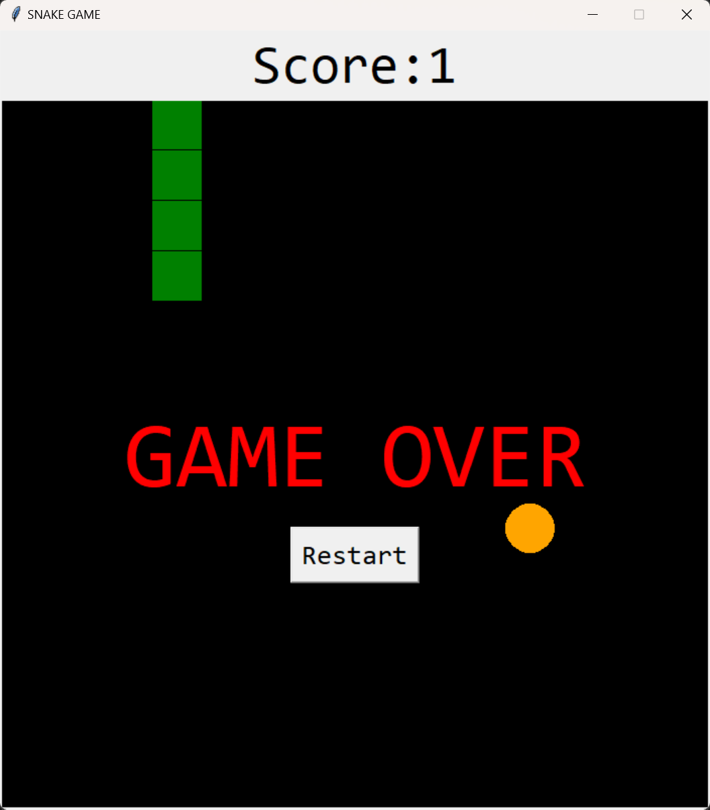

# Snake Game

This is a simple Snake Game implemented in Python using the popular Tkinter library.

## Description

The Snake Game is a classic arcade game where the player controls a snake that moves around the game board. The objective is to eat food (represented by orange squares) to grow in length. The game ends when the snake collides with the walls or with itself.

## Features

- Control the snake using arrow keys (Up, Down, Left, Right).
- Score display.
- Game over message and restart button upon collision.
- Responsive window size adjustment.

## Requirements

- Python 3.x
- Tkinter library (usually included in Python standard library)

## Installation and Usage

1. Clone the repository:

```bash
git clone https://github.com/yourusername/snake_game_python.git
```

2. Navigate to the project directory:

```bash
cd snake_game_python
```

3. Run the game:

```bash
python snake.py
```

4. Use the arrow keys to control the snake. Eat food to grow and avoid collisions with walls or the snake itself.

5. Upon game over, click the "Restart" button to start a new game.

## Screenshots



## Contributing

Contributions are welcome! If you have any suggestions, improvements, or feature requests, feel free to open an issue or create a pull request.

## Contributors

- [Thomas Bundy](https://github.com/bundy92) - Electrical Engineer

## License

This project is licensed under the MIT License - see the [LICENSE](LICENSE) file for details.
